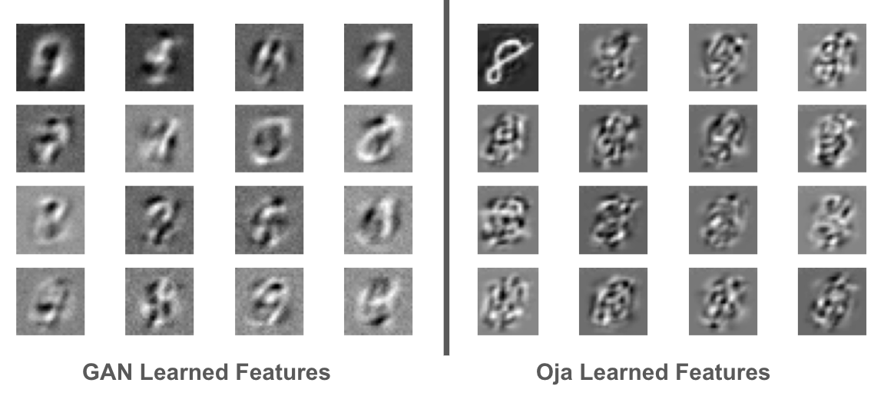
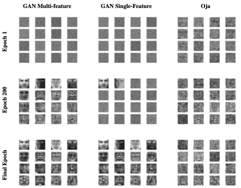
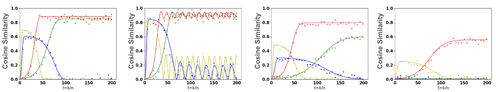

# Exploring the Precise Dynamics of Single-Layer GAN Models: Leveraging Multi-Feature Discriminators for High-Dimensional Subspace Learning

[Paper Link](https://arxiv.org/abs/2411.00498)

Andrew Bond, Zafer Dogan

## Algorithms
The files `oja.py`, `past.py`, `petrels.py`, `grouse.py`, and `gan.py` all contain the empirical implementations of the different algorithms. The simulations can be run with the `simulations.py` file.

  

For testing specifically on the eigenfaces (Olivetti Faces) dataset, the `eigenface_training.ipynb` jupyter notebook can be used.

  

## ODE
The relevant ODEs are implemented in the `ode_different_dims.py` and `ode.py` files, depending on which version you want to use. You can run the comparison of ODE vs GAN model using the `training.py` file.

  

